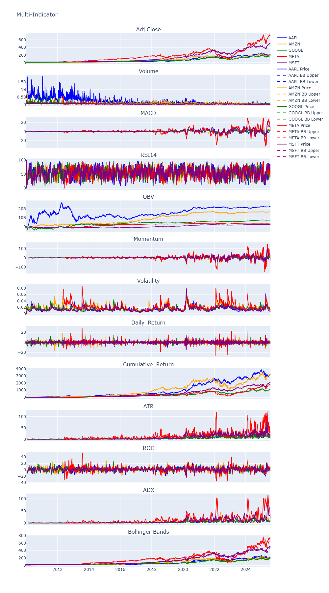
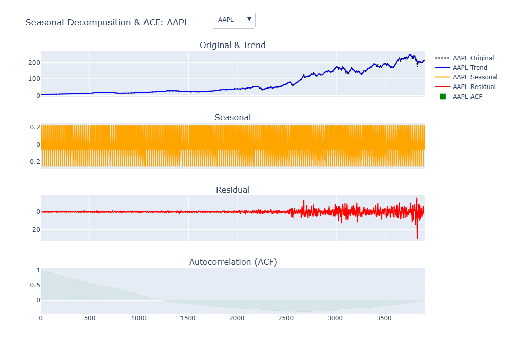
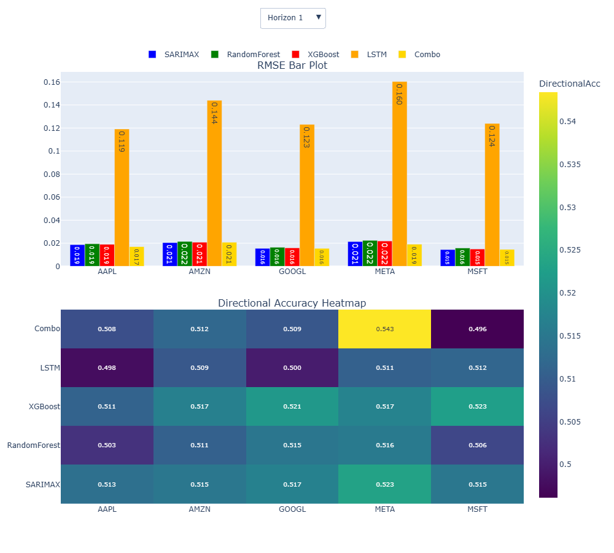
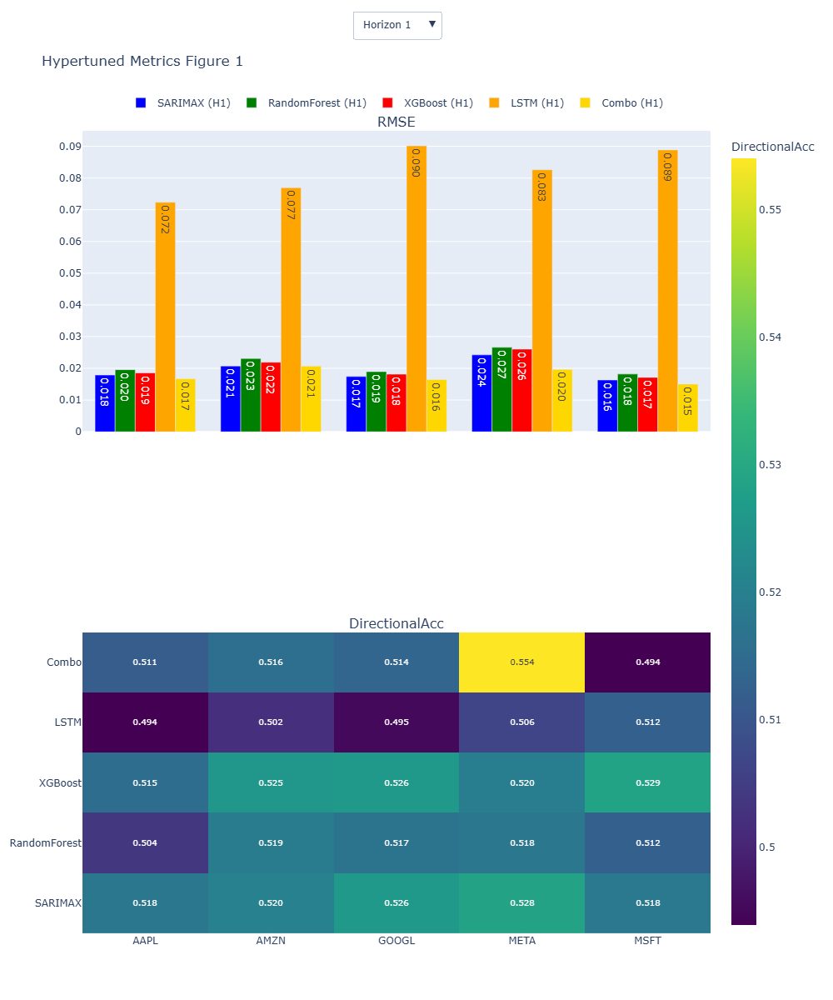
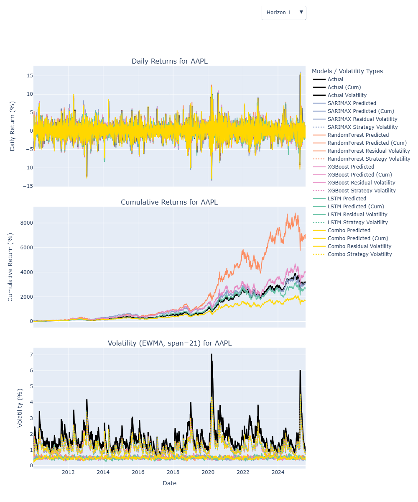
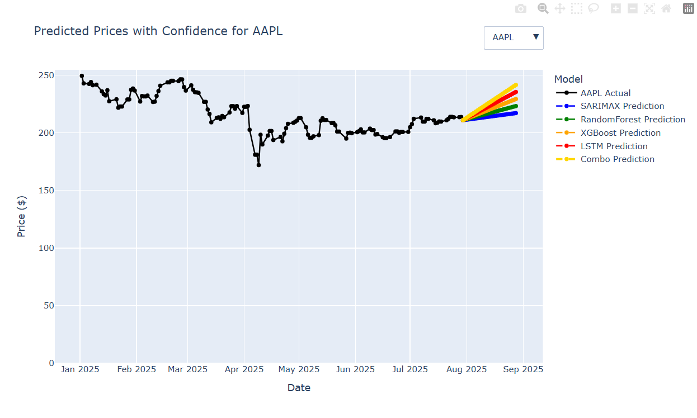

# Forecasting Stock Prices of Big Tech Companies 📈

[](https://www.python.org/)
[](https://www.tensorflow.org/)
[](LICENSE)
[](https://github.com/HRNBEnninful/Project/stargazers)
[](https://github.com/HRNBEnninful/Project/network)

---

## 📑 Abstract
The rapid proliferation of technology has made tech-related companies some of the most profitable in modern markets.  
With investors increasingly seeking data-driven insights, this work evaluates the performance of different machine learning models in predicting and forecasting stock prices of major U.S. Big Tech companies.  

The study also examines how risks and volatilities influence stock price behavior, providing a comprehensive perspective on investment decision-making in the technology sector.

---

## 🔍 Description
This project applies **statistical, machine learning, and deep learning models** to forecast the stock prices of the top five major technology companies:  
**Apple, Amazon, Google, Meta, and Microsoft** — for horizons of **1, 5, 10, and 21 trading days**.  

The goal is to compare how different algorithms perform in predicting future trends using historical stock price data.

---

## 🚀 Features
- Data collection from **Yahoo Finance**
- Preprocessing: missing values, normalization, scaling, feature engineering
- Visualization of price and volume trends, plus multi-indicator features
- Dimensionality reduction with **PCA** and clustering with **GMM** before ML models
- Forecasting using:
  - SARIMA
  - Random Forest Regressor
  - XGBoost 
  - LSTM (Long Short-Term Memory networks)
  - **Combo** (Voting Regressor combining all four models)
- Evaluation metrics: **RMSE, MAE, MAPE, MSE**
- Visualization of:
  - RMSE, Directional Accuracy, Sharpe Ratio, CumPnL
  - Forecast plots with confidence intervals
- Hyperparameter tuning for model optimization
- Backtesting with daily returns, cumulative returns, residual & strategy volatility
- Comparative metrics per ticker and horizon

---

## ⚙️ Installation

Clone the repository and install dependencies:

```bash
git clone https://github.com/HRNBEnninful/Greenbootcamps_Final_Project.git
cd Final_Project
pip install -r requirements.txt
jupyter notebook Greenbootcamps_Final_Project.ipynb
```

---

## 📊 Results (Highlights)
- The Combo (Voting Regressor) achieved the strongest short-term performance.
- SARIMA performed well in stable conditions but underperformed during high volatility.
- LSTM performed worst due to missed hyperparameter tuning.
- Forecast plots demonstrated strong short-term alignment but higher uncertainty for long horizons.









## 🤝 Contributing
Contributions are welcome! 
Please:
- Fork the repository
- Create a feature branch (git checkout -b feature-newmodel)
- Commit changes and push
- Open a Pull Request

## 📜 License
This project is licensed under the MIT License – feel free to use and modify.

## 📬 Contact
Henry Reynolds Nana Benyin Enninful Dr. rer. nat.
- 📧 Email: hrnbenninful@gmail.com
- 🐙 GitHub: @HRNBEnninful
- 💼 LinkedIn: https://www.linkedin.com/in/henryrnbenninful/


